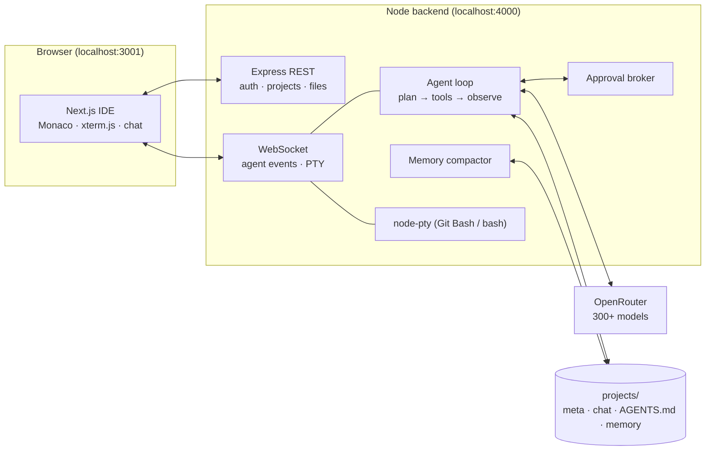

<div align="center">


# Forge

**Self-hosted AI coding studio — describe it, watch it get built.**

An open-source, local-first agentic IDE in the spirit of Bolt.new and Claude Code.
Pick any model on OpenRouter (including free ones), type what you want, and Forge
plans, writes files, runs commands, and verifies the result — asking your permission
along the way, or running fully autonomous. Your choice.

[](LICENSE)
[](https://nodejs.org)
[-8b5cf6)](https://openrouter.ai/models)
[](#requirements)
[](#contributing)

<!-- TODO: add a screenshot or demo GIF here: docs/screenshot.png -->

</div>

---

## ✨ Features

- 🖥️ **Full 4-panel IDE in your browser** — project sidebar with live file tree, Monaco editor (the VS Code editor) with tabs, streaming agent chat, and a **real PTY terminal** (xterm.js) scoped to each project
- 🤖 **Autonomous agent loop** — the model plans, then calls real tools (`read_file`, `write_file`, `create_folder`, `run_command`, `list_files`, `delete_file`, `search_files`) in a think → act → observe loop until the task is done
- 🎛️ **Any OpenRouter model** — searchable picker over the full catalog (300+) with pricing, context sizes, a **Free only** filter, and per-project model overrides
- 🛡️ **Claude Code–style permissions** — three modes per project:
  | Mode | File writes | Deletes & shell commands |
  |------|:-----------:|:------------------------:|
  | **Ask first** (default) | 🙋 approve | 🙋 approve |
  | **Auto edits** | ✅ auto | 🙋 approve |
  | **Full auto** | ✅ auto | ✅ auto |

  Approvals appear inline with a preview of exactly what will happen — **Allow**, **Always allow** (for the session), or **Deny**. Denied actions are fed back to the model so it adapts instead of failing.
- 🧠 **Real memory** — three layers per project:
  1. Full chat history, persisted and reloaded across sessions
  2. `AGENTS.md` — persistent project memory the agent reads every session and updates when it finishes (editable in the UI)
  3. **Automatic context compaction** — once a conversation grows long, older messages are summarized into rolling session memory, so the agent never loses the thread
- 👀 **Instant preview** — one-click preview for static (`index.html`) projects
- 📱 **PWA** — install it from Chrome and run Forge in its own window like a desktop app
- 🔒 **Single-password login** with a persistent session cookie

## Requirements

- **Node.js 20+** (22 recommended)
- An **[OpenRouter](https://openrouter.ai/keys) API key** (free models work with a free account)
- Windows, macOS, or Linux
  - On Windows, **Git Bash** is auto-detected and used as the agent/terminal shell (PowerShell fallback). No compiler toolchain needed — the PTY ships prebuilt.

## 🚀 Quick start

```bash
git clone <your-repo-url> forge && cd forge

# 1. configure
cp .env.example .env        # then edit: set APP_PASSWORD and OPENROUTER_API_KEY

# 2. install + build (one time)
npm run setup

# 3. run
npm start
```

Open **http://localhost:3001**, log in, create a project, and type something like:

> *build me a portfolio website with a projects gallery and a contact form*

…then watch the file tree fill up. For development with hot reload use `npm run dev`.

> **Tip:** in Chrome, ⋮ → *Cast, save and share* → **Install page as app** to get Forge in its own window.

## ⚙️ Configuration

All secrets live in `.env` at the repo root (gitignored):

| Variable | Meaning | Default |
|----------|---------|---------|
| `APP_PASSWORD` | login password | *(required)* |
| `OPENROUTER_API_KEY` | your OpenRouter key | *(required)* |
| `DEFAULT_MODEL` | default model id | `moonshotai/kimi-k2.6` |
| `PROJECTS_ROOT` | where projects are stored | `./projects` |
| `BACKEND_PORT` | backend port | `4000` |
| `FORGE_SHELL` | override the shell binary | auto (Git Bash → PowerShell) |

Runtime settings (default model, default permission mode) persist in `settings.json`; per-project overrides live in each project's `meta.json` — both managed from the UI.

## 🧭 Using Forge

- **Model** — click the model chip in the Agent panel header to open the picker. Free models are badged `FREE` (note: free tiers are often rate-limited upstream by their providers).
- **Permission mode** — the dropdown next to the model chip. Start with *Ask first*; switch a trusted project to *Full auto* for hands-off builds.
- **Memory** — the 🧠 button opens the project's `AGENTS.md` (editable) and the auto-compacted session summary.
- **Terminal** — toggle with the Terminal button. It's a real shell in the project directory; whatever the agent installs, you can run.
- **Preview** — for static sites, the Preview button renders `index.html` in an iframe. For dev-server projects (Next.js, Vite…), run `npm run dev` in the terminal and open the port it prints.

## 🏗️ Architecture



- **backend/** — Express + WebSocket: auth, project/file APIs, the streaming agent loop (OpenRouter function-calling), approval broker, session-memory compactor, chokidar live file watching, PTY via [`@lydell/node-pty`](https://github.com/lydell/node-pty) (prebuilt binaries)
- **frontend/** — Next.js 14 dark-theme IDE
- **projects/** — your work (gitignored): each project holds `meta.json`, `chat.json`, `AGENTS.md`, `memory.json` + whatever the agent builds

## 🔐 Security notes

- File tools are **sandboxed to the active project directory** (path-escape attempts are rejected).
- `run_command` executes real shell commands in the project folder — that's the point. Keep **Ask first** on when trying prompts you don't fully trust, and read the approval previews.
- The app binds to localhost by intent. Don't expose ports 3001/4000 to the internet without adding TLS and real auth in front.
- Your OpenRouter key never leaves the backend; the browser talks only to Forge.

## 🧰 Troubleshooting

| Symptom | Fix |
|---------|-----|
| `EADDRINUSE` on 3001/4000 | Something else owns the port — change `BACKEND_PORT` in `.env` and/or the `-p` flag in `frontend/package.json` |
| Free model returns 429 | Upstream free-tier throttling, not a Forge bug — pick another free model or a paid one |
| Terminal shows PowerShell on Windows | Git Bash wasn't found — install Git for Windows or set `FORGE_SHELL` |
| Agent "denied" its own actions | Session-long *Always allow* resets on reconnect — that's by design |

## 🗺️ Roadmap

- [ ] Dev-server preview proxy (live preview for Next/Vite projects, not just static)
- [ ] Diff view for file-write approvals
- [ ] Multi-agent runs / background tasks
- [ ] Git integration (auto-commit checkpoints per agent run)
- [ ] Token/cost meter per run

## Contributing

Issues and PRs welcome. Keep changes focused, match the existing style, and test the approval flow in *Ask first* mode before submitting agent-loop changes.

## License

[MIT](LICENSE)
